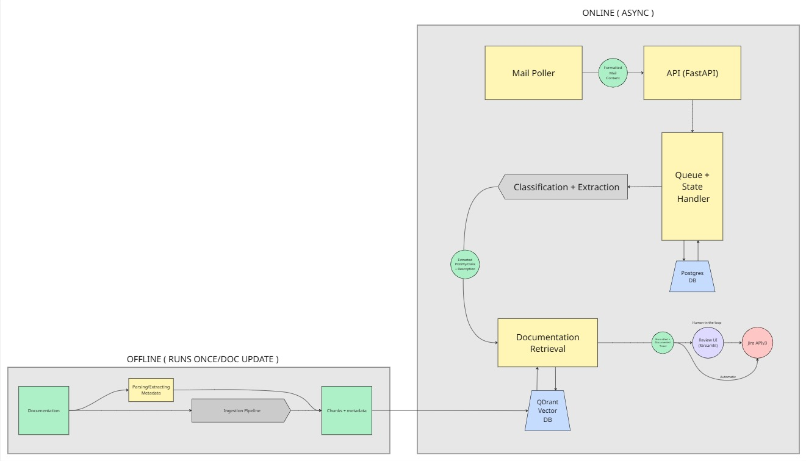

# Jira Mail Assistant

Prototype d'assistant LLM + RAG pour la qualification automatique des demandes clients.

Analyse un email client, en extrait les informations clés, recherche la documentation PowerCARD pertinente, et pré-remplit un ticket Jira, validé par un relecteur humain avant création.

## Fonctionnement

**Offline** — la documentation PowerCARD est parsée, découpée, vectorisée et indexée dans Qdrant avec ses métadonnées (type de document, module, version).

**Online** — pour chaque email :

1. L'email entre dans le système (collage ou upload `.eml`)
2. Un LLM extrait les champs clés et génère un résumé structuré
3. La recherche RAG identifie les documents les plus pertinents
4. Le relecteur valide et corrige via l'interface
5. Le ticket Jira est créé avec les champs pré-remplis

Aucun ticket n'est écrit dans Jira sans validation humaine explicite.

## Stack

| Composant | Choix |
| --- | --- |
| API | FastAPI + Pydantic |
| LLM | Azure OpenAI ou Mistral local (interchangeable) |
| Embeddings | `multilingual-e5-large` |
| Vector store | Qdrant |
| Queue + état | PostgreSQL |
| Interface | Streamlit |
| Infra | Docker Compose |

## Structure

```text
schemas/     # modèles Pydantic — le contrat partagé de bout en bout
services/    # logique métier pure (extraction, retrieval, mapping Jira)
clients/     # wrappers interchangeables (LLM, embeddings, Qdrant, Jira)
api/         # routes FastAPI
worker/      # boucle de traitement des jobs
ingestion/   # pipeline documentaire offline
db/          # modèles et requêtes Postgres
ui/          # interface de relecture Streamlit
```

## Démarrage

```bash
cp .env.example .env     # configurer LLM_PROVIDER, JIRA_*, QDRANT_*
docker compose up
```

# Plan Architecture

Plan du prototype de l'architecture. 

