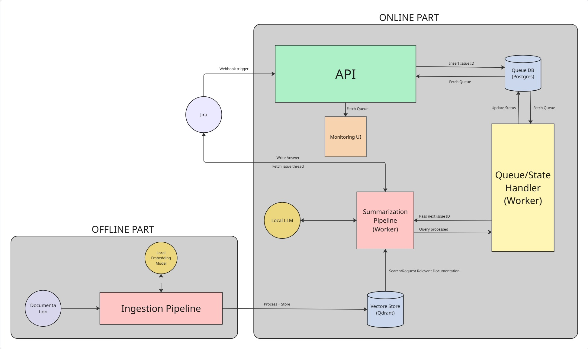

# Jira Issue Assistant

> This is an actively evolving prototype. Several components described here are stubs or
> partially wired, the architecture is still being reshaped, and **breaking changes should be
> expected**.

On-demand assistant for Jira Service Management support threads, built around an LLM and a
(planned) RAG retrieval layer.

A support engineer invokes the assistant on a request. It reads the full comment thread,
produces a structured summary of the request and its current state, and posts the result back
as an **internal** comment. Retrieval of the most relevant documentation is the next milestone
— the corpus pipeline and vector store exist but are not yet connected to the online path.

---

## Why

Support handles most client requests directly in the thread. Creating tickets is not the
bottleneck. What still costs time is two things:

1. **Picking up a long thread** and reconstructing where it stands.
2. **Hunting through** specifications, change requests, technical guides, and API
   documentation to find the relevant reference.

The assistant targets (1) today and (2) next.

---

## Project status

The table below is the source of truth for this repository. Anything marked *planned* or
*stub* is not usable yet, regardless of how it may appear in the code.

| Area | Status | Notes |
| --- | --- | --- |
| Jira webhook receiver | ✅ Working | `POST /webhooks`, filters on internal `/assist` comments |
| Postgres job queue | ✅ Working | Table auto-created, `FOR UPDATE SKIP LOCKED` claim, orphan sweep on boot |
| Worker loop | ✅ Working | Single worker, polls every 2s, retryable/terminal error split |
| Jira API client | ✅ Working | Fetch issue, post internal comment, edit comment; exponential-backoff retry |
| Thread formatting (ADF → text) | ✅ Working | Flattens description + comments into a plain-text transcript |
| LLM summarization | ✅ Working | Local Mistral via Ollama, prompt pulled from Langfuse |
| Observability | ✅ Working | Langfuse traces on the processing chain, generation, and formatting |
| Manual eval harness | 🟡 Partial | Needle-in-answer hit rate over a CSV test set; not a real eval suite |
| Docker Compose stack | 🟡 Partial | Runs, but the app image must be built by hand (no `build:` stanza) |
| **RAG retrieval** | 🔴 **Not wired** | Qdrant + embedding clients exist; nothing in the online path calls them |
| **Ingestion pipeline** | 🔴 **Stub** | `IngestionPipeline.init()` is a `pass`; `Parser` has no implementation |
| Mail poller | 🔴 Stub | `Poller` / `IMAPMailClient` are empty placeholders |
| Webhook authentication | 🔴 Missing | The endpoint is currently unauthenticated |

---

## How it works

### Offline (planned)

The documentation corpus is parsed, chunked, embedded, and indexed in Qdrant along with its
metadata (document type, module, version). *The chunking, embedding, and upsert steps are
implemented in [ingestion/ingestion.py](ingestion/ingestion.py); corpus loading and parsing are
not.*

### Online (current behaviour)

1. A support engineer posts an **internal** comment containing exactly `/assist`.
2. A Jira webhook hits `POST /webhooks`; the request is validated and pushed onto the Postgres
   queue.
3. The worker claims the oldest pending job and marks it `processing`.
4. The full issue — description plus every comment — is fetched from the Jira REST API and
   flattened to plain text.
5. A placeholder comment (`Processing...`) is posted immediately so the engineer sees the
   assistant picked the request up.
6. The LLM is prompted with the transcript using the `issue-thread-prompt` template pulled from
   Langfuse.
7. The placeholder is **edited in place** with the answer. If it was deleted in the meantime, a
   fresh comment is posted instead.
8. The job is marked `done`.

Step 6 is where retrieval will be inserted once the ingestion path is complete.

Nothing is ever visible to the client. Every comment the assistant writes carries the
`sd.public.comment → internal: true` property, and the support engineer decides what to use.

---

## Design principles

- **On demand, not continuous.** Every invocation is an explicit signal that help is needed. No
  processing of threads that do not need it.
- **Internal only.** Suggestions are for the team, never for the client.
- **Swappable by default.** Every external dependency sits behind an abstract Pydantic base
  class (`LLMClient`, `JiraClient`, `DatabaseClient`, `VectorStore`, `EmbeddingClient`) so
  backends can be replaced without touching the business logic.
- **Durable queue over in-memory state.** A crashed worker loses nothing: in-flight jobs are
  swept back to `pending` on the next boot. ( edge cases not fully covered. )

---

## Architecture



---

## Stack

| Component | Choice | Status |
| --- | --- | --- |
| API | FastAPI + Pydantic | Implemented |
| Worker | asyncio polling loop | Implemented |
| LLM | Local Mistral via Ollama | Implemented |
| LLM (alternative) | Azure OpenAI | Planned |
| Prompt management | Langfuse (`production` label) | Implemented |
| Embeddings | HF `multilingual-e5-large` | Client implemented |
| Vector store | Qdrant | Client implemented |
| Queue + state | PostgreSQL (`psycopg` async) | Implemented |
| Trigger | Jira webhook | Implemented |
| Observability | Langfuse | Implemented |
| Infra | Docker Compose | Implemented |

---

## Repository structure

```text
api/           # FastAPI app and the webhook route
clients/       # swappable backend wrappers (Jira, LLM, Postgres, Qdrant, embeddings, mail)
services/      # business logic — job queue today, retrieval later
worker/        # the job-processing loop and its entrypoint
schema/        # Pydantic models and enums — the shared end-to-end contract
ingestion/     # offline documentation pipeline (incomplete)
eval/          # manual prompt evaluation harness and test set
documentation/ # generated documentation and assets
config.py      # environment-backed settings
log_config.py  # logging setup
```

---

## Getting started

### Prerequisites

- Docker and Docker Compose
- A Jira Service Management project and an [API token](https://id.atlassian.com/manage-profile/security/api-tokens)
- A Langfuse project (cloud or self-hosted)
- Roughly 5 GB of disk for the Ollama Mistral weights

### 1. Configure the environment

```bash
cp .env.example .env
```

Every variable below is **required** — `Settings` declares no defaults, so the app fails fast
on startup if any is missing.

| Variable | Description |
| --- | --- |
| `JIRA_DOMAIN` | e.g. `https://your-domain.atlassian.net` (the scheme is stripped automatically) |
| `JIRA_API_TOKEN` | Atlassian API token |
| `JIRA_AUTH_MAIL` | Email address the token belongs to |
| `POSTGRES_HOST` | `postgres` inside Compose, `localhost` when running on the host |
| `POSTGRES_USER` | Database user |
| `POSTGRES_PASSWORD` | Database password |
| `POSTGRES_DBNAME` | Database name |
| `MODEL_BASE_URL` | Ollama host, e.g. `ollama-mistral:11434` in Compose |
| `LANGFUSE_PUBLIC_KEY` | Langfuse public key |
| `LANGFUSE_SECRET_KEY` | Langfuse secret key |
| `LANGFUSE_BASE_URL` | e.g. `https://cloud.langfuse.com` |

### 2. Create the prompt in Langfuse

The worker pulls a chat prompt named **`issue-thread-prompt`** with the label **`production`**
and injects a single variable, `{{thread}}`, containing the flattened transcript. **Processing
fails without it** — the prompt is not stored in this repository.

### 3. Build and start the stack

The Compose file references a pre-built image, so build it first:

```bash
docker build -t jira-assistant/dev:latest .
docker compose up -d
```

On first boot `ollama-mistral` pulls the model, which takes a few minutes; the worker waits on
its healthcheck. The API listens on `:8000`, Postgres on `:5432`, Qdrant on `:6333`, Ollama on
`:11434`.

Check it is alive:

```bash
curl http://localhost:8000/
# {"status":"online"}
```

### 4. Register the Jira webhook

For local development, expose the API with a tunnel (ngrok, Cloudflare Tunnel) and register the
public URL in Jira pointing at `POST /webhooks`.

---

## Evaluation

[eval/manual_eval.py](eval/manual_eval.py) runs a prompt against
[eval/test_set.csv](eval/test_set.csv) over several trials and reports a **needle hit rate** —
the fraction of expected substrings that appear in the model's answer.

```bash
mkdir -p eval/logs
python -m eval.manual_eval
```

Temperature, prompt name, and trial count are currently edited inline at the top of the file.
Results are printed as a table and written to `eval/logs/test-<timestamp>.json`.

This is a coarse smoke test for prompt regressions, **not** a rigorous evaluation. A proper
suite — semantic scoring, retrieval metrics, a held-out set — is on the roadmap.

---